# Explorife — Entity Relationship Diagram

Reverse-engineered from `supabase/migrations/*.sql`, `lib/models/*.dart`, and
every `.from('table_name')` call in `lib/providers/` + `lib/repositories/`
(no migration file exists for a handful of tables — `saved_gems`, `profiles`,
`hike_tracks`, `split_*`, `stories` predate this repo's tracked migrations, so
their shape below is inferred from the live Dart models, which several
migration comments explicitly call "the source of truth" for those tables).

`auth.users` is Supabase-managed (not owned by this app) but is included as a
shadow entity since almost everything hangs off it via `owner_id`/`user_id`/
`created_by` columns.

Paste the block below into https://mermaid.live to render it, or view it
directly — GitHub, most IDEs, and Notion render ```mermaid fences natively.

```mermaid
erDiagram
    AUTH_USERS ||--o| PROFILES : "has"
    AUTH_USERS ||--o{ TRIPS : owns
    AUTH_USERS ||--o{ TRIP_COLLABORATORS : "is member"
    AUTH_USERS ||--o{ SAVED_GEMS : drops
    AUTH_USERS ||--o{ GEM_SAVES : saves
    AUTH_USERS ||--o{ HIKE_TRACKS : logs
    AUTH_USERS ||--o{ TRIP_BOOKINGS : "created_by"
    AUTH_USERS ||--o{ SPLIT_GROUPS : creates
    AUTH_USERS ||--o{ SPLIT_GROUP_MEMBERS : "belongs to"
    AUTH_USERS ||--o{ SPLIT_EXPENSES : "paid_by / created_by"
    AUTH_USERS ||--o{ SPLIT_EXPENSE_SHARES : owes
    AUTH_USERS ||--o{ SPLIT_SETTLEMENTS : "from/to/recorded_by"

    TRIPS ||--o{ TRIP_STOPS : contains
    TRIPS ||--o{ TRIP_COLLABORATORS : has
    TRIPS ||--o{ TRIP_CHECKLIST_ITEMS : has
    TRIPS ||--o{ TRIP_CATEGORY_BUDGETS : has
    TRIPS ||--o{ TRIP_BOOKINGS : has
    TRIPS ||--o{ TRIP_DOCUMENTS : has
    TRIPS ||--o{ TRIP_PACKING_ITEMS : has
    TRIPS |o--o| SPLIT_GROUPS : "shadow group (trip_id, unique, nullable)"
    TRIPS ||--o{ SPLIT_EXPENSES : "trip-linked expenses (nullable)"
    TRIP_BLUEPRINTS |o..o{ TRIPS : "seeds via template_id (soft, no FK)"

    TRIP_STOPS }o--o| SAVED_GEMS : "gem_id (nullable)"
    TRIP_STOPS |o--o| TRIP_BOOKINGS : "booking_id (nullable)"
    TRIP_BOOKINGS }o--o| TRIP_STOPS : "stop_id (nullable, separate FK)"

    TRIP_COLLABORATORS ||--o{ TRIP_DOCUMENTS : "owner_collaborator_id"
    TRIP_COLLABORATORS ||--o{ TRIP_PACKING_ITEMS : "assignee_collaborator_id"

    SAVED_GEMS ||--o{ GEM_SAVES : "saved by"

    SPLIT_GROUPS ||--o{ SPLIT_GROUP_MEMBERS : has
    SPLIT_GROUPS ||--o{ SPLIT_EXPENSES : has
    SPLIT_GROUPS ||--o{ SPLIT_SETTLEMENTS : has
    SPLIT_EXPENSES ||--o{ SPLIT_EXPENSE_SHARES : has

    AUTH_USERS {
        uuid id PK
        text email
    }

    PROFILES {
        uuid id PK "FK -> auth.users.id"
        text display_name
        text avatar_url
        text username UK "case-insensitive unique"
    }

    TRIPS {
        uuid id PK
        uuid owner_id FK
        text name
        text location
        double location_lat "nullable"
        double location_lng "nullable"
        date start_date
        date end_date
        bigint budget_vnd
        text currency "default VND"
        text vibe
        uuid template_id "soft ref, no FK constraint"
        timestamptz created_at
    }

    TRIP_STOPS {
        uuid id PK
        uuid trip_id FK
        int day
        text slot "morning/afternoon/evening"
        uuid gem_id FK "nullable -> saved_gems"
        jsonb custom_payload "nullable"
        bigint price_vnd "nullable = TBD"
        int sort_order
        text transit_mode "nullable"
        text transit_line "nullable"
        int transit_duration_min "nullable"
        bigint transit_cost_vnd "nullable"
        time start_time "nullable"
        text notes "nullable"
        uuid booking_id FK "nullable -> trip_bookings"
    }

    TRIP_COLLABORATORS {
        uuid id UK "surrogate, not PK"
        uuid trip_id PK,FK
        uuid user_id PK,FK
        text permission "view/edit"
        text status "confirmed/invited"
    }

    TRIP_BLUEPRINTS {
        uuid id PK
        text location "not FK, catalogue key"
        text title
        text meta "nullable"
        jsonb items_json
        int save_count
        timestamptz created_at
    }

    TRIP_CHECKLIST_ITEMS {
        uuid id PK
        uuid trip_id FK
        text section "7d_before/1d_before/departure_day/miscellaneous"
        text title
        bool is_checked
        int sort_order
        int due_date_offset_days "nullable"
        timestamptz created_at
        timestamptz updated_at "nullable, trigger-maintained"
    }

    TRIP_CATEGORY_BUDGETS {
        uuid id PK
        uuid trip_id FK
        text category "stay/food/activity/transit/shopping/insurance/misc/flights"
        bigint planned_vnd
        timestamptz updated_at "nullable"
    }

    TRIP_BOOKINGS {
        uuid id PK
        uuid trip_id FK
        uuid stop_id FK "nullable -> trip_stops"
        text booking_type "flight/stay/activity/transport"
        text title
        text confirmation_ref "nullable"
        text provider "nullable"
        timestamptz start_at "nullable"
        timestamptz end_at "nullable"
        bigint amount_vnd "nullable = unknown"
        text status "to_book/booked/paid"
        uuid created_by FK "nullable"
        timestamptz created_at
    }

    TRIP_DOCUMENTS {
        uuid id PK
        uuid trip_id FK
        uuid owner_collaborator_id FK "nullable = shared"
        text type "passport/visa/ticket/reservation/insurance"
        text title
        text file_url "nullable"
        date expires_on "nullable"
        timestamptz created_at
    }

    TRIP_PACKING_ITEMS {
        uuid id PK
        uuid trip_id FK
        uuid assignee_collaborator_id FK "nullable = shared"
        text label
        text category "nullable"
        int quantity
        bool is_packed
        int sort_order
        timestamptz created_at
    }

    SAVED_GEMS {
        uuid id PK
        uuid user_id FK "dropper"
        text gem_name
        text gem_location "nullable"
        text category "nullable"
        jsonb gem_coords "nullable, {lat,lng}"
        text tagline "nullable"
        text description "nullable"
        text photo_url "nullable"
        text difficulty "nullable"
        text best_time_to_visit "nullable"
        int est_duration_min "nullable"
        timestamptz saved_at
    }

    GEM_SAVES {
        uuid user_id PK,FK
        uuid gem_id PK,FK
        timestamptz saved_at
    }

    HIKE_TRACKS {
        uuid id PK
        uuid user_id FK
        text title
        text activity_type
        timestamptz started_at
        timestamptz ended_at "nullable"
        double distance_km "nullable"
        int duration_seconds "nullable"
        double elevation_gain_m "nullable"
        bool featured
        timestamptz created_at
    }

    SPLIT_GROUPS {
        uuid id PK
        text name
        text description "nullable"
        uuid created_by FK
        timestamptz created_at
        uuid trip_id FK,UK "nullable, unique — shadow group"
    }

    SPLIT_GROUP_MEMBERS {
        uuid group_id PK,FK
        uuid user_id PK,FK
    }

    SPLIT_EXPENSES {
        uuid id PK
        uuid group_id FK "nullable"
        uuid paid_by FK "nullable"
        text title
        double amount
        text currency
        timestamptz created_at
        uuid trip_id FK "nullable"
        text category "nullable, matches trip_category_budgets vocab"
        timestamptz expense_date
        text split_type "equal/exact/percentage"
        text notes "nullable"
        text receipt_url "nullable"
        uuid created_by FK "nullable"
        bool is_settlement
        timestamptz updated_at "nullable"
    }

    SPLIT_EXPENSE_SHARES {
        uuid id PK
        uuid expense_id FK "nullable"
        uuid user_id FK "nullable"
        double amount
        bool is_settled
    }

    SPLIT_SETTLEMENTS {
        uuid id PK
        uuid group_id FK "nullable"
        uuid from_user FK "nullable"
        uuid to_user FK "nullable"
        double amount
        text note "nullable"
        timestamptz settled_at "nullable"
        uuid recorded_by FK "nullable"
    }
```



## Notes / oddities worth knowing before you design against this

- **`trip_stops.booking_id` and `trip_bookings.stop_id` are two independent,
  unreconciled FKs** pointing at each other's tables. A stop can link to a
  booking and a booking can (separately) link to a stop, but nothing enforces
  they agree. See migration `20260806000700`'s comment.
- **`trip_blueprints.template_id` on `trips` is not a real foreign key** — no
  `references` clause was ever added, so blueprint seeding is soft/historical
  only.
- **`gem_saves` vs `saved_gems`**: `saved_gems` is the actual gem catalogue
  (despite the name); `gem_saves` is the per-user heart/save join table.
  The migration comment calls `gem_saves` "UNWIRED for v1" but
  `GemRepository` (via `savesTable`) does read/write it today — that comment
  is stale.
- **`stories` and `trip_blueprints` have no owning-user FK at all** — stories
  are identified by a free-typed `email` string (public submission form, not
  auth-linked); blueprints are a shared read-only catalogue.
- **`destinations` table**: referenced only in a commented-out line in the
  repo and has a `Destination` Dart model with fields (`rating`,
  `reviewCount`, `pricePerNight`, `tags`) that don't match any other table
  here — left out of the diagram as effectively unused/legacy.
- Every `*_vnd` / `amount` money field that's nullable follows the same
  contract throughout this schema: `null` = "not yet known/priced", `0` = a
  confirmed free/zero value. Never coalesce one into the other.
